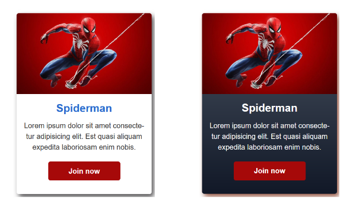

# Práctica de CSS: Uso de box-shadow

## Descripción

Este proyecto es una práctica diseñada para explorar y entender el uso de `box-shadow` en CSS. Cubre conceptos como la creación de sombras internas y externas, cómo ajustar la difuminación y el radio de la sombra, y cómo utilizar múltiples sombras.

## Contenidos

Este proyecto incluye los siguientes archivos:

- `index.html`: La estructura básica del contenido de la página web.
- `styles.css`: La hoja de estilos que se utiliza para aplicar distintos bordes a los elementos HTML.
- `reset.css`: La hoja reset contiene el reset de código CSS.
- `img/`: Carpeta que contiene los recursos de medios utilizados en el proyecto, como imágenes e iconos.
- `README.md`: Este archivo que estás leyendo.

## Cómo Usar Este Proyecto

Para probar este proyecto, abre `index.html` en tu navegador. Podrás ver cómo se aplican diferentes estilos de bordes a los elementos HTML.

Para modificar los estilos, abre `styles.css` en tu editor de texto favorito y haz los cambios que desees. Recarga `index.html` en tu navegador para ver los efectos de tus cambios.

## Práctica de clase

Esta es una práctica de clase a la que le he realizado mis propias modificaciones al ejercicio propuesto contenida en la siguiente clase:

- [Clase 30 - Box-shadow en CSS / Curso Domina CSS3 - Jordan Alexander](https://www.udemy.com/course/css3-curso-completo/learn/lecture/23601080#overview)

- [Gradientes utilizados](https://hypercolor.dev/#gradients)

## 👉 Recursos de Aprendizaje

Si estás aprendiendo CSS y el uso de `box-shadow`, aquí te dejo algunos enlaces útiles:

- [W3Schools - CSS Box Shadows](https://www.w3schools.com/css/css3_shadows_box.asp)
- [MDN Web Docs - Box Shadow](https://developer.mozilla.org/en-US/docs/Web/CSS/box-shadow)

Si deseas aprender sobre el reset de CSS utilizado en este proyecto, este enlace contiene información sobre el mismo:

- [Reset CSS PRO - Eduardo Fierro](https://github.com/eduardofierropro/Reset-CSS)

## Contribuir

Este es un proyecto de código abierto y las contribuciones son bienvenidas. Si tienes algún ejemplo interesante o útil de cómo usar bordes en CSS, no dudes en hacer un PR.

## Mis perfiles

## 📄 Licencia

Este proyecto se distribuye bajo la licencia MIT. Consulta el archivo `LICENSE` para obtener más detalles.

MIT Public License v3.0
No puede usarse comercialmente
